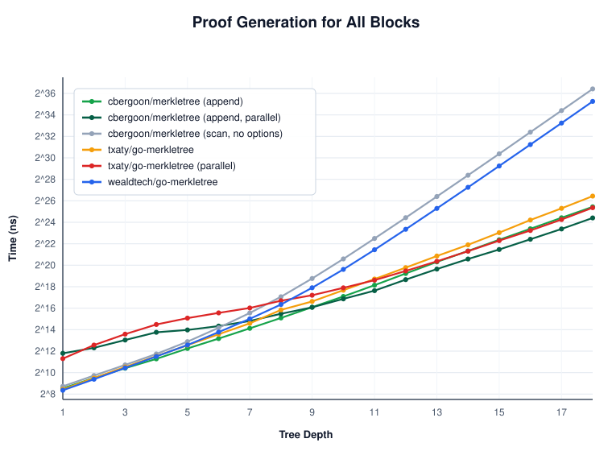
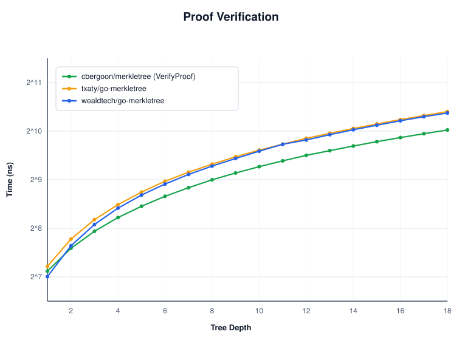
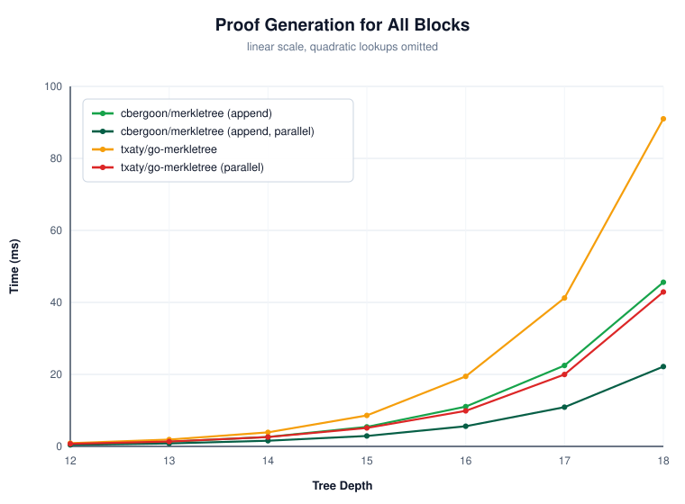
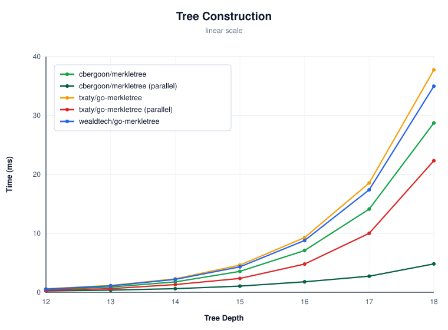
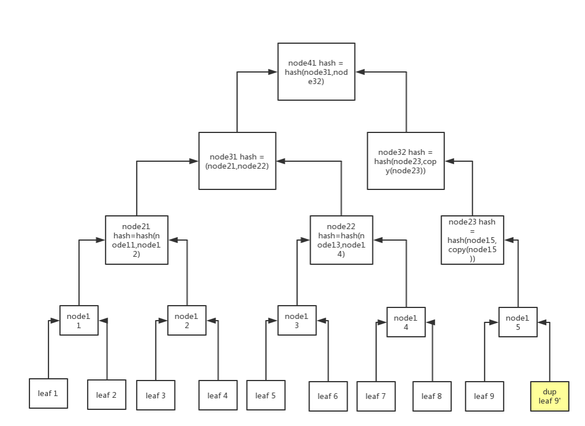

<h1 align="center">Merkle Tree in Golang</h1>
<p align="center">
<a href="https://github.com/cbergoon/merkletree/actions/workflows/ci.yml"></a>
<a href="https://pkg.go.dev/github.com/cbergoon/merkletree"></a>
<a href="#"></a>
</p>

An implementation of a Merkle Tree written in Go. A Merkle Tree is a hash tree that provides an efficient way to verify
the contents of a set data are present and untampered with.

At its core, a Merkle Tree is a list of items representing the data that should be verified. Each of these items
is inserted into a leaf node and a tree of hashes is constructed bottom up using a hash of the nodes left and
right children's hashes. This means that the root node will effictively be a hash of all other nodes (hashes) in
the tree. This property allows the tree to be reproduced and thus verified by on the hash of the root node
of the tree. The benefit of the tree structure is verifying any single content entry in the tree will require only
nlog2(n) steps in the worst case.

#### Documentation 

See the docs [here](https://pkg.go.dev/github.com/cbergoon/merkletree).

#### Constructions

The tree can be built three ways. They produce different roots and are not interchangeable,
so pick one when the tree is created.

| Construction | Built with | Notes |
| --- | --- | --- |
| Bitcoin-style (default) | `NewTree`, `NewTreeWithHashStrategy` | Pairs siblings in order, duplicates the last node on an odd count |
| Sorted siblings | `NewTreeWithHashStrategySorted`, `WithSortedSiblings()` | Orders each pair before hashing, matching OpenZeppelin `MerkleProof` |
| RFC 6962 | `WithRFC6962()` | Prefixed leaf and interior hashes, splits instead of padding |

The default follows Bitcoin so that roots line up with Bitcoin-style trees. Two well known
properties come along with that.

A level holding an odd number of nodes duplicates its last node so it can be paired, which
means a tree built from an odd number of leaves has the same root as a tree that spells the
duplicate out. This is CVE-2012-2459:

```
[A, B, C]  and  [A, B, C, C]  ->  same root
[A]        and  [A, A]        ->  same root
```

There is also no separation between leaf and interior hashes. Both are computed the same
way, so an interior digest can be handed back as a leaf. A two leaf tree whose leaves are
the two subtree hashes of a four leaf tree reproduces the original root exactly, and the
forged tree verifies against itself.

Sorted mode shares both of those and additionally discards leaf order: `[A B C D]`,
`[B A C D]` and `[D C B A]` all produce the same root, because each pair is ordered before
it is hashed. Only regrouping which leaves are paired changes the root. Check
`tree.Sorted()` if you depend on the root committing to order.

##### RFC 6962

`WithRFC6962()` builds the tree as
[RFC 6962 section 2.1](https://datatracker.ietf.org/doc/html/rfc6962#section-2.1)

```go
tree, err := merkletree.NewTreeWithOptions(list, merkletree.WithRFC6962())
```

Leaf hashes are computed as `H(0x00 ‖ digest)` and interior hashes as `H(0x01 ‖ left ‖ right)`,
so a forged leaf would need a genuine collision between two differently prefixed inputs
rather than a rearrangement. Odd node counts are split at the largest power of two below
their length instead of being padded, so every distinct leaf sequence gets a distinct
root and `[A, B, C]` no longer collides with `[A, B, C, C]`.

One caveat: RFC 6962 hashes raw leaf data, whereas this tree hashes whatever
`CalculateHash` returns. Roots match a Certificate Transparency log only if your
`CalculateHash` returns the leaf bytes themselves rather than a digest of them. 

`WithRFC6962()` cannot be combined with `WithSortedSiblings()`; RFC 6962 specifies its own
sibling ordering.

#### Parallel construction

`WithParallelism(n)` builds the tree across up to `n` goroutines, or GOMAXPROCS of them
when `n < 1`. It is off by default.

```go
tree, err := merkletree.NewTreeWithOptions(list, merkletree.WithParallelism(0))
```

`Content.CalculateHash` is called concurrently when this is set, so your implementation
has to be safe for that. Nothing else in the package calls it concurrently, and the tree
has no way to check whether yours is safe.

Parallel `CalculateHash` costs measured on an M5 Max.

| Content | Leaves | Serial | Parallel | |
| --- | --- | --- | --- | --- |
| short string | 256 | 26.5µs | 43.7µs | 0.61× (slower) |
| short string | 4,096 | 476µs | 333µs | 1.43× |
| short string | 65,536 | 6.40ms | 2.14ms | 2.99× |
| 4KB blob | 4,096 | 5.21ms | 723µs | 7.21× |

The option covers each construction type including `WithRFC6962`. An RFC build of 65,536 short
leaves drops from 9.98ms serial to 2.01ms in parallel.

Parallelism is not recorded when a tree is serialized since it has no bearing on the
root.

#### Serving proofs

`GetMerklePath` locates content by scanning every leaf. Build with `WithLeafIndex` to
make that one hash and a map probe, or address leaves by position with
`GetMerklePathByIndex`. When proofs are served at rate, the two slices each proof
returns become the bottleneck and the garbage collector turns into the shared resource
every goroutine queues on. The `Append` forms generate the same proofs into buffers you
own, so a server that reuses them allocates nothing per proof:

```go
var path [][]byte
var index []int64
for i := range list {
  path, index, err = t.AppendMerklePathByIndex(path[:0], index[:0], i)
  // path holds the sibling hashes, index which side each sits on
}
```

The appended hashes are the tree's own, not copies. Treat them as read-only and copy
any proof that must outlive the next reuse of its buffer.

At 65,536 leaves a proof appends in ~17ns against ~76ns returning fresh slices. Under 
18 goroutines serving from one shared tree the append form runs at 2.9ns per proof, 28× 
the slice-returning form, because with no allocation there is nothing shared left to queue 
on. 

#### Serialization

A tree can be written out and read back. What gets written is the content the tree is rebuilt from:
the ordered leaf content, the name of the hash strategy, the sibling sort flag, and the Merkle root. 
The recorded root makes decoding self-checking, so a payload that has been altered, or that is decoded
with the wrong hash strategy, fails as expected.

Register your content type and the standard codecs work directly:

```go
merkletree.RegisterContent(TestContent{}) // needs MarshalBinary/UnmarshalBinary

err := gob.NewEncoder(&buf).Encode(tree)

var decoded merkletree.MerkleTree
err = gob.NewDecoder(&buf).Decode(&decoded)
```

`MarshalBinary`, `UnmarshalBinary`, `MarshalJSON`, and `UnmarshalJSON` are all available
so anything built on `encoding.BinaryMarshaler` or `json.Marshaler` works too.

To avoid the package-level registry entirely for content that already has an encoding of its
own just supply the content marshallers directly:

```go
data, err := tree.MarshalWith(func(c merkletree.Content) ([]byte, error) {
  return []byte(c.(TestContent).x), nil
})

decoded, err := merkletree.UnmarshalWith(data, func(b []byte) (merkletree.Content, error) {
  return TestContent{x: string(b)}, nil
})
```

Everything in the standard library is registered for you; anything else is one call:

```go
merkletree.RegisterHashStrategy("keccak256", sha3.NewLegacyKeccak256)
tree, err := merkletree.NewTreeWithHashStrategy(list, sha3.NewLegacyKeccak256)
```

#### Comparison

Measured against the other Merkle tree libraries in the Go ecosystem: `txaty/go-merkletree`,
`wealdtech/go-merkletree`, `onrik/gomerkle`, `xsleonard/go-merkle` and `jvsteiner/merkle`,
with SHA-256 and the same leaf data throughout. The comparison and analysis are in 
[`benchmarks/ANALYSIS.md`](benchmarks/ANALYSIS.md); the numbers below are from an Apple M5 Max
on Go 1.26, so treat the ratios as the durable part. This analysis, benchmarks and the following 
comparison brief was AI assisted and verified using a reference implementation. 

`txaty/go-merkletree` gets its own column because it is the closest competitor. It is the
only other library here with parallel construction, and its published comparisons are what
prompted this exercise. 

| | merkletree | txaty | best of the rest | rank |
|---|---|---|---|---|
| Construction, serial (65,536 leaves) | 7.67 ms | 9.67 ms | onrik 7.61 ms | 2 / 6 |
| Construction, parallel (65,536 leaves) | **3.08 ms** | 6.47 ms | txaty 6.47 ms | **1 / 2** |
| Parallel speedup, 16 KiB leaves | **12.8×** | 11.9× | txaty 11.9× | **1 / 2** |
| Allocations building 65,536 leaves | 131,140 | 328,230 | onrik 131,090 | 2 / 6 |
| Memory building 65,536 leaves | 18.4 MB | 24.8 MB | wealdtech 11.5 MB | 4 / 6 |
| Single proof (65,536 leaves) | **16.7 ns** | 128 ns | txaty 128 ns | **1 / 6** |
| Full proof set (4,096 leaves) | **25.4 ns/proof** | 158 ns/proof | txaty 158 ns/proof | **1 / 6** |
| Verify a proof (65,536 leaves) | **934 ns** | 1,212 ns | onrik 1,108 ns | **1 / 4** |
| Concurrent proofs, 18 goroutines | **2.9 ns/op** | 165 ns/op | jvsteiner 153 ns/op | **1 / 6** |
| Concurrent scaling, 1 → 18 goroutines | **16.4×** | 1.14× | wealdtech 13.1× | **1 / 6** |
| Proof size on the wire, depth 16 | 640 B | 516 B | txaty 516 B | 2 / 2 |


| | merkletree | txaty | wealdtech | onrik | xsleonard | jvsteiner |
|---|---|---|---|---|---|---|
| Proof generation | ✅ | ✅ | ✅ | ✅ | ❌ | ✅ |
| Proof by leaf position <sup>1</sup> | ✅ | ✅ | ❌ | ✅ | ❌ | ✅ |
| Allocation-free proofs <sup>2</sup> | ✅ | ❌ | ❌ | ❌ | ❌ | ❌ |
| Verify without the tree <sup>3</sup> | ✅ | ✅ | ✅ | ❌ | ❌ | ✅ |
| Parallel construction | ✅ | ✅ | ❌ | ❌ | ❌ | ❌ |
| Pluggable hash | ✅ | ✅ | ✅ | ✅ | ✅ | ❌ |
| Sorted siblings (OpenZeppelin) | ✅ | ✅ | ❌ | ❌ | ✅ | ❌ |
| RFC 6962 | ✅ | ❌ | ❌ | ❌ | ❌ | ❌ |
| Serialization | ✅ | ❌ | ❌ | ❌ | ❌ | ❌ |
| Runtime dependencies | none | x/sync | x/crypto | none | none | protobuf |
| Odd leaf count | duplicate <sup>4</sup> | duplicate | pad to 2ⁿ | promote | promote <sup>5</sup> | promote |

<sup>1</sup> Addressing a leaf by position rather than by value, which avoids hashing the
query. txaty offers this only through the precomputed `Proofs` slice in `ModeProofGen`.
It matters more than it looks: at 16 KiB leaves, by position is 95× faster than by value.
<sup>2</sup> `AppendMerklePath` and `AppendMerklePathByIndex` write into slices the
caller supplies and keeps, so a proof server reusing its buffers generates proofs without
allocating at all. No other library here exposes the proof buffers; every one of them
returns freshly allocated structures. That is also what makes the concurrency row
possible. A proof that allocates nothing shares nothing, so it scales with cores instead
of contending on the garbage collector.
<sup>3</sup> A package-level verify taking a proof, a root and the data. onrik's is a
method, so it needs a `Tree` value it does not otherwise use.
<sup>4</sup> Or split, under `WithRFC6962`. <sup>5</sup> Or duplicate, with `DoubleOddNodes`.

That last row decides interoperability. These libraries agree on the root for
any power-of-two leaf count and split into three groups otherwise, so a proof from one
group will not verify against a root from another. merkletree's default agrees with txaty
and with xsleonard's `DoubleOddNodes`; its `WithRFC6962` mode is checked against the
Certificate Transparency reference vectors in [`oracle/`](oracle/).

#### Benchmark

Setup:

| Machine | CPU | Memory | OS | Hash Function | Go Version |
| --- | --- | --- | --- | --- | --- |
| MacBook Pro | Apple M5 Max, 18 core | 36GB | macOS 26.4 | SHA256 | 1.26.3 |

Benchmark tasks:

1. **Proof generation for all the blocks**: from a cold start, build the tree and come away
   holding the Merkle root and the proofs of every data block.
2. **Tree construction**: build the tree and stop, which is the part `WithParallelism`
   actually changes.
3. **Proof verification**: verify a single proof against a root.

<p align="center">


</p>

> *Note:* the number of data blocks is 2<sup>depth</sup>, so each step on the x-axis is
> twice the work of the one before it. The y-axis is logarithmic to fit the full range,
> which means the real gaps between lines are much larger than they look. One gridline
> is a doubling.

At depth 18 (262,144 leaves), generating every proof:

| | time | vs. merkletree |
| --- | --- | --- |
| **merkletree** (append, parallel) | **22.2 ms** | — |
| txaty/go-merkletree (parallel) | 42.9 ms | 1.9× |
| **merkletree** (append) | 45.6 ms | 2.1× |
| txaty/go-merkletree | 91.0 ms | 4.1× |
| wealdtech/go-merkletree | 41.0 s | 1,849× |
| merkletree without either option | 91.8 s | 4,143× |

The last row is the same library with no options set, and it is on the chart on purpose.
`GetMerklePath` locates content by scanning every leaf, so a full proof set is O(n²),
which is what put this library at the top of the earlier published comparisons. Building
with `WithLeafIndex`, or addressing leaves by position with `GetMerklePathByIndex` and the
`Append` forms, is the difference between the top line and the bottom one.

Both parallel lines sit *above* their serial counterparts until the tree is large enough
to pay for the goroutines: merkletree breaks even around depth 9 (512 leaves) and txaty at
depth 11. Below that, parallel construction is a loss for both, 10× worse at depth 1,
which is why neither library enables it by default. Leaves here are 64 bytes; the more
expensive the content, the earlier the crossover (see
[`benchmarks/ANALYSIS.md`](benchmarks/ANALYSIS.md), which puts it below 256 leaves at 1 KiB
and below 64 at 16 KiB).

Verification is a like-for-like comparison, a proof replayed against a root with no tree
involved. At depth 18 merkletree verifies in 1,074 ns against txaty's 1,418 ns and
wealdtech's 1,355 ns, allocating 2 objects where the others grow with tree depth.

##### The same numbers on a linear axis

A log axis is the only way to fit a range that runs from nanoseconds to a minute and a
half, but it also flattens the thing the chart is there to show. One gridline is a
doubling, so a line sitting four times above another looks two gridlines away rather than
four times worse. The same measurements on a linear scale, over the depths where the
absolute differences are big enough to see:

<p align="center">


</p>

The left chart leaves out the two quadratic lines. By depth 18 they are three orders of
magnitude above everything else, and an axis tall enough to hold them puts the rest of
the field flat on the floor. They are still on the log chart above and in the table.

The right chart is construction on its own, no proofs. The three serial lines land within
a third of each other because they are all doing the same SHA-256 in the same order, so
that is the band to read the parallel ones against. At depth 18 txaty's parallel build gains
1.7× on its own serial, 37.7 ms down to 22.3 ms. merkletree's gains 6×, 28.7 ms down to
4.8 ms, which is the whole distance between the top of the chart and the bottom.

Regenerate the charts and the numbers behind them with:

```bash
cd benchmarks && go run ./cmd/depthchart
```


#### Install
```
go get github.com/cbergoon/merkletree
```

#### Example Usage
Below is an example that makes use of the entire API - its quite small.
```go
package main

import (
  "crypto/sha256"
  "errors"
  "log"

  "github.com/cbergoon/merkletree"
)

//TestContent implements the Content interface provided by merkletree and represents the content stored in the tree.
type TestContent struct {
  x string
}

//CalculateHash hashes the values of a TestContent
func (t TestContent) CalculateHash() ([]byte, error) {
  h := sha256.New()
  if _, err := h.Write([]byte(t.x)); err != nil {
    return nil, err
  }

  return h.Sum(nil), nil
}

//Equals tests for equality of two Contents
func (t TestContent) Equals(other merkletree.Content) (bool, error) {
  otherTC, ok := other.(TestContent)
  if !ok {
    return false, errors.New("value is not of type TestContent")
  }
  return t.x == otherTC.x, nil
}

func main() {
  //Build list of Content to build tree
  var list []merkletree.Content
  list = append(list, TestContent{x: "Hello"})
  list = append(list, TestContent{x: "Hi"})
  list = append(list, TestContent{x: "Hey"})
  list = append(list, TestContent{x: "Hola"})

  //Create a new Merkle Tree from the list of Content
  t, err := merkletree.NewTree(list)
  if err != nil {
    log.Fatal(err)
  }

  //Get the Merkle Root of the tree
  mr := t.MerkleRoot()
  log.Println(mr)

  //Verify the entire tree (hashes for each node) is valid
  vt, err := t.VerifyTree()
  if err != nil {
    log.Fatal(err)
  }
  log.Println("Verify Tree: ", vt)

  //Verify a specific content in in the tree
  vc, err := t.VerifyContent(list[0])
  if err != nil {
    log.Fatal(err)
  }

  log.Println("Verify Content: ", vc)

  //String representation
  log.Println(t)
}

```
#### Sample



#### Testing

```bash
go test -race ./...       # unit, property, golden, and regression tests
scripts/fuzz.sh           # every fuzz target, 30s each
scripts/bench.sh          # benchmarks, 6 runs each
```

The suite checks roots against a reference implementation written directly from each
construction's definition, and pins golden roots and golden serialized payloads that
were produced outside this repository. A change to the hashing or the wire format has
to be made in several independent places before it can pass unnoticed, and regenerating 
a golden payload to make a test pass is a compatibility break.

##### Fuzzing

A normal test run only replays each target's seed corpus. `scripts/fuzz.sh` does the
actual fuzzing.

```bash
scripts/fuzz.sh                       # every target, 30s each
scripts/fuzz.sh FuzzUnmarshalBinary   # just one
FUZZTIME=5m scripts/fuzz.sh           # longer budget per target
```

| Target | What it drives |
| --- | --- |
| `FuzzTreeInvariants` | Tree construction, verification, and proof replay across every construction |
| `FuzzUnmarshalBinary` | The binary decoder: no faults, decoded trees verify, payloads are canonical |
| `FuzzUnmarshalJSON` | The JSON decoder |
| `FuzzPayloadCorruption` | That an altered payload can never decode to a different Merkle root |


##### Benchmarks

```bash
scripts/bench.sh                          # everything
scripts/bench.sh Verify                   # only benchmarks matching /Verify/
scripts/bench.sh -o before.txt            # save a baseline
scripts/bench.sh -o after.txt -b before.txt   # ...and compare against it
scripts/bench.sh -s                       # smoke: one iteration, just checks they run
```

#### License
This project is licensed under the MIT License.
